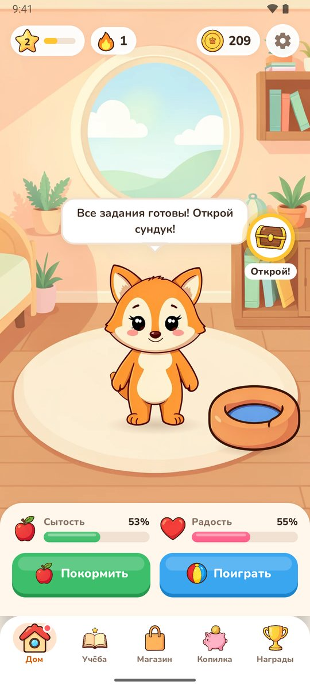
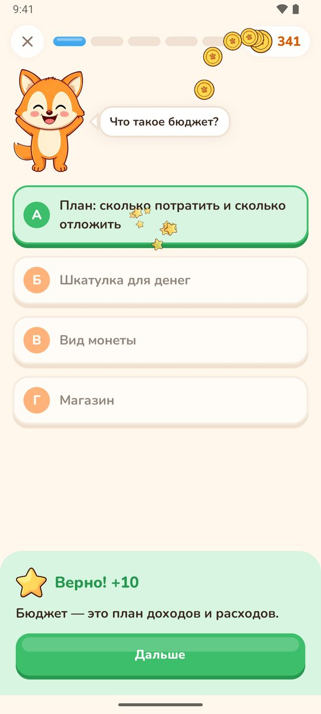
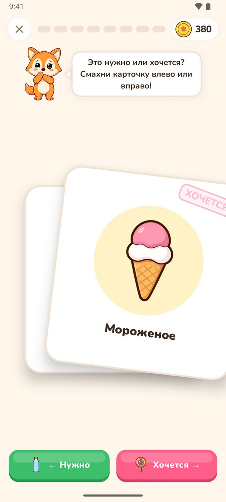
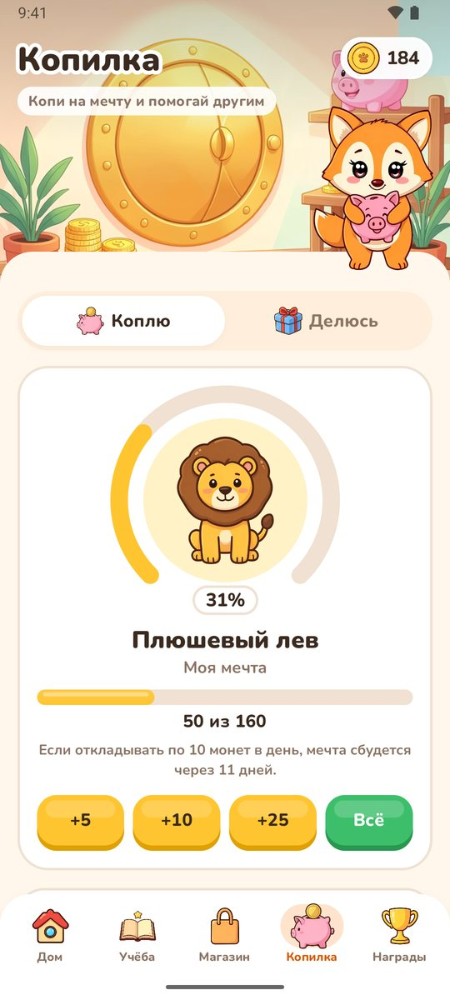

# Питомец Финни 🦊

Мобильная игра о финансовой грамотности для детей 7–11 лет. Команда «Эпики», хакатон «Лидеры цифровой
трансформации 2026», задача № 6 Департамента финансов города Москвы.

Ребёнок заботится о лисёнке Финни и на практике осваивает базовые понятия финансовой грамотности:
**зарабатывай → трать с умом → копи → делись**.

<p align="center">
  
  
  
  
</p>

## Навигация для экспертов

| Что нужно | Где смотреть |
| --- | --- |
| **Презентация** | Загружена на платформу «Лидеры цифровой трансформации» вместе с решением: 18 слайдов, обязательный блок — слайды 1–5. В открытом репозитории её нет, потому что в ней контакты участников |
| **Прототип** | Android-приложение `finni-pet-2.1.apk`: [Releases](https://github.com/ShodiShi/epics-finni-pet/releases). Android 8.0+, около 5 МБ, интернет не нужен. Установка — [ниже](#установка) |
| **Проверить приложение** | [Маршрут проверки за 5 минут](#проверка-за-5-минут) |
| **Быстро увидеть «новый день», проценты, голод питомца** | Настройки → карточка «Демо-режим»: [что делают кнопки](#демо-режим-для-проверяющих) |
| **Как устроена игра и чему она учит** | [Что есть в игре](#что-есть-в-игре) и [Экономика игры в цифрах](#экономика-игры) |
| **Исходный код** | [Карта кода](#карта-исходного-кода) |
| **Технологии и архитектура** | [Стек](#стек) и [Карта кода](#карта-исходного-кода) |
| **Тесты** | `./gradlew test` — 22 теста игровой логики: [`GameLogicTest.kt`](app/src/test/java/ru/finnipet/app/domain/GameLogicTest.kt) |
| **Как сделаны графика, музыка и звуки** | [Как сделаны ассеты](#как-сделаны-ассеты), папка [`tools/`](tools) |
| **Команда** | [Команда](#команда) |

## Установка

1. Скачайте `finni-pet-2.1.apk` со страницы [Releases](https://github.com/ShodiShi/epics-finni-pet/releases)
   на телефон с Android 8.0 или новее.
2. Откройте файл и разрешите установку из этого источника, если система попросит.
3. Запустите «Питомец Финни». Разрешений приложение не запрашивает.

Установить на эмулятор или подключённый телефон можно и из исходников: `./gradlew installDebug`
(подробности — в разделе [Сборка и запуск](#сборка-и-запуск)).

## Проверка за 5 минут

Игра рассчитана на короткие ежедневные сессии, поэтому её удобно смотреть в таком порядке:

1. **Знакомство.** Четыре экрана приветствия, затем имя питомца и кнопка «Поехали!». Изначально у ребёнка 40 монет,
   яблоко и мяч.
2. **Дом.** Погладьте Финни (нажмите на него), нажмите «Покормить» и «Поиграть», выберите вещь из рюкзака.
   Сытость и радость растут, Финни отвечает позой и репликой.
3. **Учёба → «Вопросы дня».** Пять вопросов о деньгах: за верный ответ +10 монет, после любого ответа Финни
   объясняет, почему так.
4. **Учёба → «Нужно или хочется?».** Смахните восемь карточек влево («нужно») или вправо («хочется»):
   +2 монеты за верный ответ, при ошибке Финни объясняет.
5. **Магазин.** Купите еду («нужно») и игрушку («хочется»). Если монет не хватает, игра подсказывает, где их
   заработать.
6. **Копилка.** Во вкладке «Коплю» положите монеты в мечту, во вкладке «Делюсь» — в добрую цель.
   Когда цель собрана, вещь появляется в комнате Финни.
7. **Настройки → «Демо-режим» → «Новый день».** Копилка начислит 5% («проценты»), обновятся вопросы и задания.
   «Проголодаться» и «Заскучать» показывают, как питомец просит внимания.
8. **Награды.** Уровень и медали; медаль нажатием открывается с описанием и прогрессом.

## Что есть в игре

- **Дом** — комната Финни. Его можно погладить, покормить и порадовать игрушкой; у лисёнка 17 поз и реплики-подсказки.
  Сытость и радость понемногу убывают. Три задания дня (учёба, забота, копилка) открывают сундук с монетами.
- **Учёба** — 5 вопросов дня о деньгах с объяснениями (всего 25 вопросов) и серия дней подряд.
  Мини-игра «Нужно или хочется?»: карточки смахиваются влево или вправо, при ошибке Финни объясняет ответ.
- **Магазин** — еда («нужно») и игрушки («хочется»). Если монет не хватает, игра подскажет, где их заработать.
- **Копилка** — мечты по очереди: лежанка, плюшевый лев, велосипед, домик. Каждая накопленная мечта
  появляется в комнате Финни. Каждый новый день копилка добавляет 5% («проценты»). Во вкладке «Делюсь» —
  добрые цели: корм для приюта, книги для библиотеки, дерево в парке.
- **Награды** — уровни и 9 медалей с прогрессом.

Оформление: иллюстрации, «объёмные» кнопки, частицы (монеты, конфетти, сердечки), звуки, фоновая музыка
и праздничные экраны за награды. Празднования ждут окончания викторины или мини-игры, чтобы не перебивать ребёнка.
Тексты не зависят от пола игрока.

Прогресс хранится только на устройстве (Jetpack DataStore): без сети, бэкенда и аккаунтов. Приложение не запрашивает
никаких разрешений.

### Демо-режим для проверяющих

В **Настройках** (шестерёнка на главном экране) есть карточка «Демо-режим». Четыре кнопки показывают, как игра
меняется со временем, не дожидаясь его:

- **Проголодаться** и **Заскучать** — Финни просит еду или игру;
- **+100 монет** — монеты для покупок и копилки;
- **Новый день** — обновляются вопросы и задания, копилка начисляет проценты.

После нажатия появляется подсказка с кнопкой «К Финни». Кнопки меняют прогресс; вернуть всё можно кнопкой
«Сбросить прогресс» в конце настроек.

## Экономика игры

Все числа заданы в коде ([`Economy`](app/src/main/java/ru/finnipet/app/domain/GameLogic.kt), товары и цели — в соседних
файлах `domain/`) и покрыты тестами.

| Что | Значение |
| --- | --- |
| Стартовый набор | 40 монет, яблоко и мяч |
| Вопросы дня | 5 в день, +10 монет за верный ответ |
| «Нужно или хочется?» | 8 карточек в день, +2 монеты за верный ответ |
| Сундук за три задания дня | +25 монет |
| Цены еды / игрушек | 10–25 монет / 18–45 монет |
| Мечты в копилке | 100, 160, 240 и 350 монет |
| Добрые цели («Делюсь») | 40, 60 и 80 монет |
| Проценты | +5% в день к накопленному в копилке |
| Сытость / радость | убывают на 5 / 3 пункта в час; ниже 30 Финни просит еду или игру |

## Стек

- Kotlin, Jetpack Compose (Material 3, BOM 2026.09), Navigation Compose
- Android Gradle Plugin 9.4 (Kotlin встроен в AGP), плагины Compose и serialization 2.4.20, Gradle 9.6.1
- kotlinx.serialization + DataStore Preferences
- compileSdk / targetSdk 37, minSdk 26

## Сборка и запуск

Нужны JDK 17+ и Android SDK с платформой 37 (`sdk.dir` в `local.properties` или переменная `ANDROID_HOME`).

```bash
./gradlew assembleDebug      # APK: app/build/outputs/apk/debug/
./gradlew installDebug       # установить на подключённое устройство или эмулятор
./gradlew test               # юнит-тесты игровой логики
./gradlew assembleRelease    # сжатый R8 APK: app/build/outputs/apk/release/
```

Release-сборка подписана отладочным ключом, чтобы её можно было сразу установить на телефон (sideload).

## Карта исходного кода

Игровая логика отделена от интерфейса: `domain/` — чистые функции без Android-зависимостей.

| Папка или файл (`app/src/main/java/ru/finnipet/app/`) | Что внутри |
| --- | --- |
| [`domain/GameLogic.kt`](app/src/main/java/ru/finnipet/app/domain/GameLogic.kt) | экономика, задания дня, копилка, проценты, уровни, награды |
| [`domain/`](app/src/main/java/ru/finnipet/app/domain) | вопросы, карточки, товары, цели, медали, позы Финни |
| [`data/`](app/src/main/java/ru/finnipet/app/data) | `GameState` (сериализуемое состояние) и `GameRepository` (DataStore) |
| [`ui/GameViewModel.kt`](app/src/main/java/ru/finnipet/app/ui/GameViewModel.kt) | состояние игры, действия, события наград, демо-режим |
| [`ui/FinniApp.kt`](app/src/main/java/ru/finnipet/app/ui/FinniApp.kt) | навигация и очередь праздничных экранов |
| [`ui/screens/`](app/src/main/java/ru/finnipet/app/ui/screens) | экраны: дом, учёба, викторина, мини-игра, магазин, копилка, награды, настройки |
| [`ui/components/`](app/src/main/java/ru/finnipet/app/ui/components) | кнопки, панели, спрайт Финни, пузыри реплик, вкладки, тосты |
| [`ui/fx/`](app/src/main/java/ru/finnipet/app/ui/fx) | частицы, звуки, фоновая музыка |
| [`ui/theme/`](app/src/main/java/ru/finnipet/app/ui/theme) | цвета, шрифт Nunito, формы |
| [`res/drawable-nodpi/`](app/src/main/res/drawable-nodpi) | иллюстрации (WebP) |
| [`res/raw/`](app/src/main/res/raw) | звуки и музыкальная петля |

## Как сделаны ассеты

Иллюстрации и музыка сгенерированы локально через ComfyUI, звуки синтезированы. Скрипты лежат в `tools/`
и запускаются встроенным Python из ComfyUI (`python_embeded\python.exe`):

- `tools/art/generate.py [имя ...]` — FLUX.2 Klein; позы Финни рисуются по референсу персонажа.
  Сырые PNG сохраняются вне репозитория.
- `tools/art/process.py [имя ...]` — удаляет белый фон, обрезает и сохраняет WebP в `res/drawable-nodpi`,
  а также собирает иконку приложения.
- `tools/sfx/make_sfx.py` — синтез звуковых эффектов (numpy).
- `tools/sfx/music.py [seed ...]` — фоновая музыка через MiniMax H3.
- `tools/sfx/make_loop.py <клип>` — бесшовная петля `res/raw/music_loop.wav`.

## Команда

**«Эпики»** — студенты бакалавриата ТГУ (Томск), специальность — DevOps. Руслан — лидер команды, Шодиёрбек —
проектирование и инфраструктура. Состав и контакты — на слайдах 2–4 презентации.

## Лицензии

Код — MIT, см. [`LICENSE`](LICENSE). Шрифт Nunito — SIL Open Font License 1.1 (`third_party/nunito/OFL.txt`).
